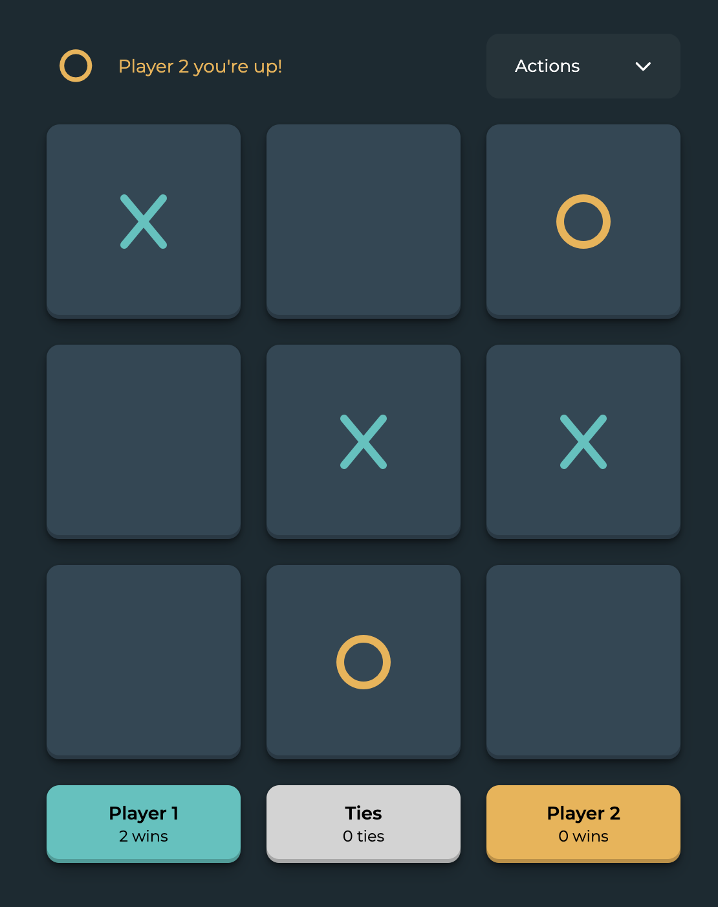

# Tic-Tac-Toe Vanilla JS

A Tic-Tac-Toe game built with vanilla JavaScript, no frameworks or dependencies.



## Features

- **Data persistence**: Results are saved in `localStorage`, allowing you to close the browser and resume where you left off
- **Multi-tab sync**: Game state synchronizes in real-time across multiple browser tabs
- **Round system**: Tracks wins per player and ties across multiple games
- **Responsive design**: Adapted for mobile and desktop

## Architecture

The project follows an MVC (Model-View-Controller) pattern:

```
js/
├── app.js    # Controller - Initialization and event handling
├── store.js  # Model - Game state and business logic
└── view.js   # View - DOM manipulation and rendering
```

### Technical decisions

- **ES6 Modules** for code organization
- **Classes with private methods** (`#`) for encapsulation
- **EventTarget API** for component communication
- **structuredClone** for immutable state management

## Installation

No installation required. Simply open `index.html` in your browser.

```bash
# Or if you prefer using a local server:
npx serve .
```

## Demo

[Live demo](https://vanillajs-tic-tac-toe.netlify.app/)

---

Original project from freeCodeCamp, adapted by [Mati Gaijin Dev](https://matiasfernandez.me)
